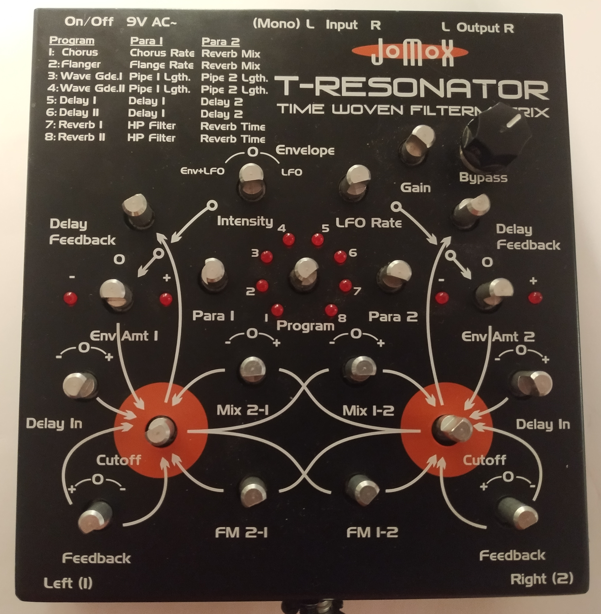
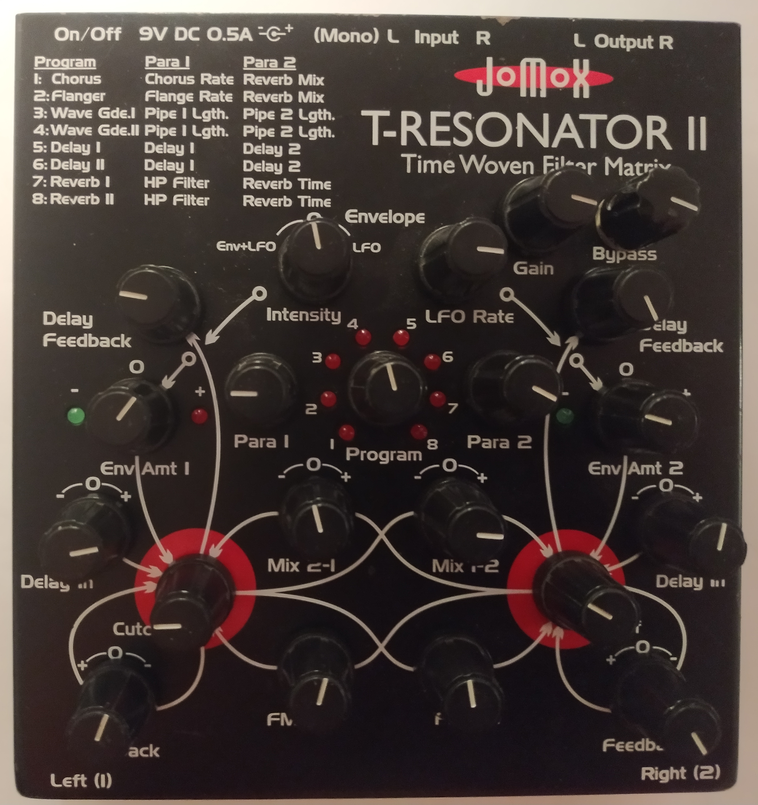
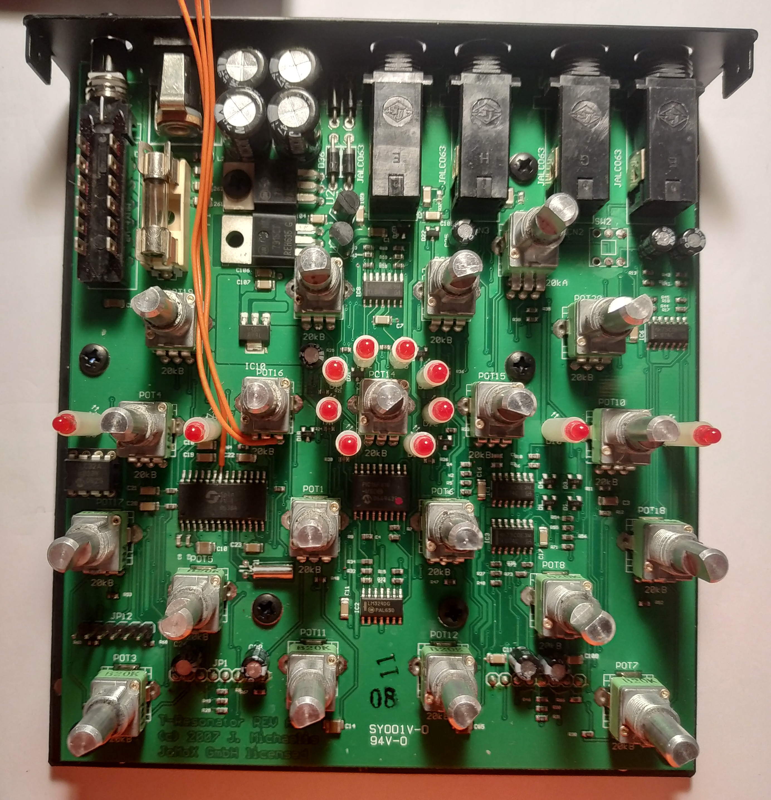
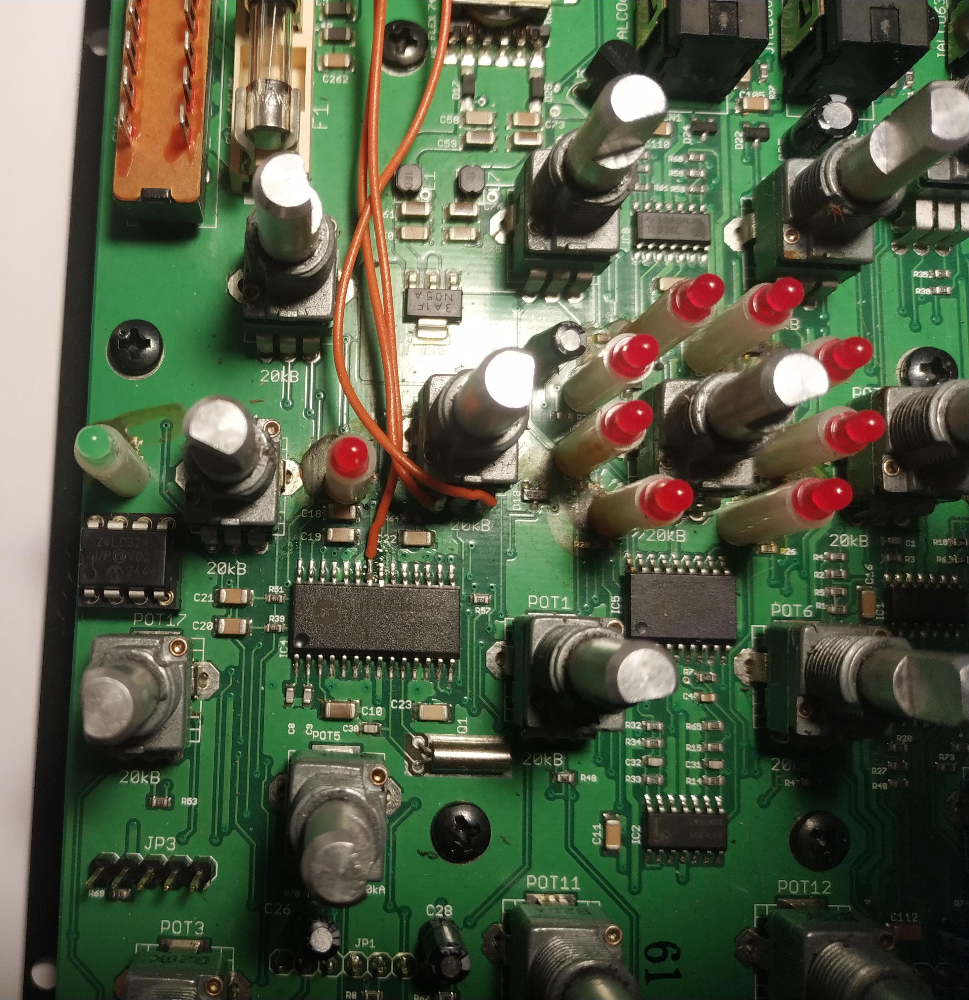
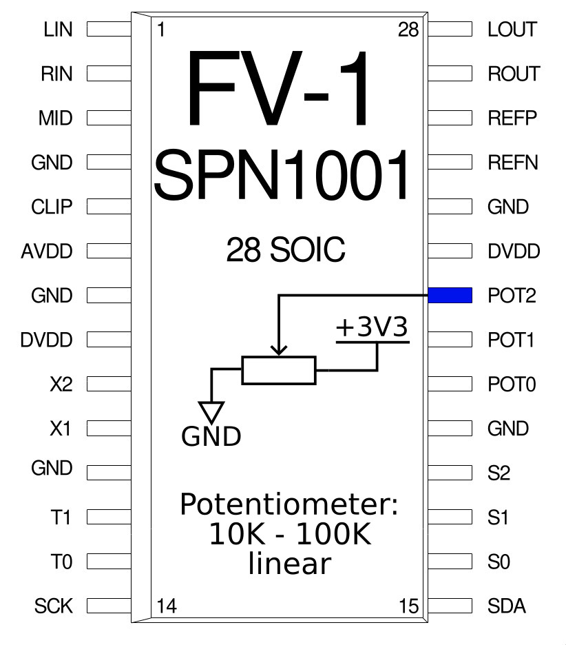
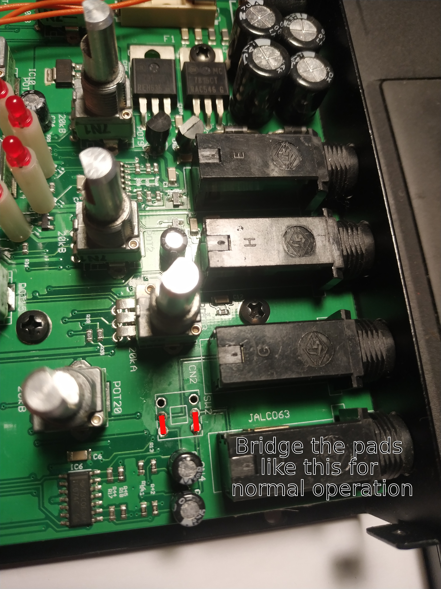
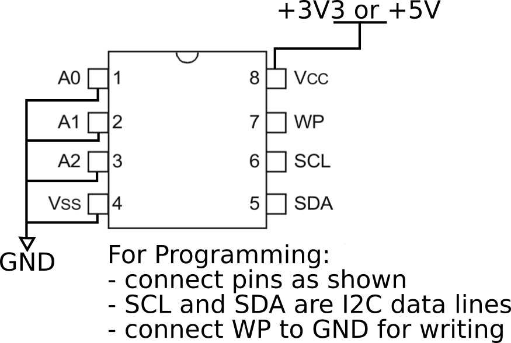

# Modding of JoMoX T-Resonator
Within this gist you will find instructions and ideas on how to mod your JoMoX T-Resonator.
The mod you will find here revolves around the FX section of the T-Resonator. What this enables
you to do is change the effects to new ones enabling your T-Resonator to produce different sounds
from the factory settings.

# Shoutouts
First of all big, big Thanks to Jürgen Michaelis from <a href=">https://www.jomox.de/">JoMoX</a> for
developing and building this freaky, awesome sound device. Keep on rocking!

Big Thanks to <a href="https://github.com/ndf-zz/">ndf-zz</a> who wrote an assembler and disassembler
for the FV-1 chip in Python. Without your work this would not have been this easy. Check out his Python
assembler and disassembler:
- <a href="https://github.com/ndf-zz/asfv1">FV-1 Assembler</a>
- <a href="https://github.com/ndf-zz/disfv1">FV-1 Disassembler</a>

Big Thanks to <a href="https://github.com/mstratman">mstratman</a> for creating a curated list of FV-1
programs and Thanks to everyone contributing programs to the collection. This made testing new audio
effects on the T-Resonator much easier. Check out the collection of FV-1 programs here:
- <a href="https://mstratman.github.io/fv1-programs/">Huge list of FV-1 programs</a>

# Resources
Resources I came along during the trip down the rabbit hole.

## Resources for FV-1 Chip
IC is manufactured by Spinsemi:
- <a href="https://www.uk-electronic.de/PDF/FV-1.pdf">FV-1 Datasheet</a>

Getting information on how to program this chip is a little harder to obtain. However there
are some infos still around:
- <a href="https://xenvn.com/threads/spin-fv-1-audio-effects.125">FV-1 Audio Effects</a>
- <a href="https://xenvn.com/threads/spin-fv-1-instructions-and-syntax.122/">FV-1 Assembly Instructions and Syntax</a>
- <a href="https://xenvn.com/threads/basics-of-the-lfos-in-the-spin-fv-1.123/">FV-1 Basics of the lfos</a>

## Resources for programming FV-1 Chip EEPROM

- <https://github.com/audiofab/fv1_programmer>
- <https://www.musikding.rocks/forum/index.php?thread/421356-howto-fv-1-eeprom-beschreiben/> (german article)

The FV-1 uses 24LC32A EEPROMs to store the audio effect programs
- <a href="https://ww1.microchip.com/downloads/aemDocuments/documents/MPD/ProductDocuments/DataSheets/24AA32A-24LC32A-32-Kbit-I2C-Serial-EEPROM-DS20001713.pdf">24LC32A Datasheet</a>

# Disclaimer

In my opinion this is not a beginner friendly mod. If you are new to modding and electronics
be warned that you may get frustrated. You should know a something about EEPROM chips and
how to program them.

Before you start modding your device please make sure that you feel confident to try this.
You should be confident in soldering cables to SMD chips. If you do not have the confidence yet
practice on some broken PCBs before attempting to solder to your T-Resonator or ask someone
who is confident in SMD soldering to do the solder job for you and share some snacks :)

I do not take responsibility for any damage that may be done to your device while performing
this mod.

Now with all the precautions being said let's dig in.

# Modding your JoMoX T-Resonator MkI and MKII

To understand the basis of this mod let's take a look at the
<a href="https://www.uk-electronic.de/PDF/FV-1.pdf">FV-1 Datasheet</a>
and glimpse at the basic FV-1 schematic.

 

What you should keep in mind is that you can control this IC with three potentiometers
(which act as simple voltage dividers, so adding a control voltage here is totally possible!)
and that it uses an external EEPROM to store effects programs. This EEPROM is
what you have to reprogram to get new effects on your T-Resonator.

## Hardware Mods

Here is how my T-Resonators turned out after the mod. The knobs are missing on the MKI because
it's still open for easy access.

 
 

Now let's have a look inside the T-Resonator and see how the FV-1 is incorporated
in the device.

 
 

The picture on the left is the T-Resonator MKI and on the right you see the insides
of the T-Resonator MKII. Both of them have the mod already installed.
The difference between the MKI and MKII is mainly the
different power supply section and some changes on how the LFO works. The mod
described here is the same for both devices.

Our section of interest is located on the left side of the PCB a little
down from the middle, right under the LFO LEDs.

 

The chip where one cable is attached to is the FV-1 effect processor. Thinking back to the
typical application circuit it takes three potentiometers to change effect settings. However
the T-Resonator uses only 2 for it's effect settings. This means that when you program
new effects these new effects may use all 3 potentiometers and you can not change all parameters
with a vanilla T-Resonator. Fortunately the unused potentiometer pin is not connected
to anything and you can wire up the missing potentiometer here.

 

The middle pin of the new potentiometer goes to pin 22 which is named POT2. I attached
the outer pins of the new potentiometer to the outer pins of another effect parameter
potentiometer. The one I used is located right above the FV-1 chip.

Now you need a place to put the extra Potentiometer. Turns out that a standard 6mm shaft
type pot fits into the hole of the bypass switch. I do not use the bypass switch at all
so I removed it completely and bridged the pads for normal operation.

 
 

## Programming New Effects

Now that you have installed the third potentiometer it is time to program some new effects.
Next to the FV-1 chip right at the edge of the PCB is the EEPROM itself. As you saw in the FV-1
circuit diagram it is a 24LC32A EEPROM. Fortunately this chip is in DIP format and is
socketed so you can easily take it out for programming. There are more tutorials on how to
program the FV-1 than I can link here. Please have a look for yourself. In this text you
will only find the most basic info on how to do this.

Now comes the part where you need some kind of software to get programs in a format that
the FV-1 chips understands. Spinsemi provides a software environment. This however costs
some money. If you want to save yourself some bucks there is an open source solution
thanks to <a href="https://github.com/ndf-zz/">ndf-zz</a>.  Check out the project here:
- <a href="https://github.com/ndf-zz/asfv1">FV-1 Assembler</a>

To run this on your PC you need to have the Python interpreter installed. Please refer to
to the FV-1 assembler project README on how to get this running.

Another option is SpinCAD-Designer. A Java app in which you can program effects visually.
Check it out for yourself:
- <a href="https://github.com/HolyCityAudio/SpinCAD-Designer">SpinCAD-Designer</a>

With this you are now able to get the binary that needs to be put into the 24LC32A EEPROM.
Getting the bytes on the EEPROM is done over I2C. You need some kind of device that enables
you to do that. Looking around the web you can find different ways to do it. Most commonly
a USB to I2C bridge is used. For example chips like the MCP2221 or CH341.  Another way is
to use a microcontroller and program it to get the bytes from your PC and put write them
to the EEPROM.

For programming wire the EEPROM for example on a breadboard. Pull all all address pins
(A0 - A2) to GND, supply 3,3V or 5V to the Vcc pin. Connect the I2C pins to your programmer
of choice and make sure there are pull-up resistors (around 4K7 resistors are fine) to Vcc
on the I2C pins. For reading the WP (write protect pin) may be either Vcc or GND. If you
want to write new programs make sure to connect the WP pin to GND.

 

While doing this I realized that it's a hassle (for me at least) to program the EEPROM this
way. This got me thinking if the Python assembler program would run on microcontroller using
Micropython. Long story short: it does!! Using a raspberry pi pico microcontroller running
Micropython you can build yourself a standalone EEPROM programmer specifically for FV-1
programs that also does the assembling part for you. All you need to do is place you text
file programs on an sd card, plug it in, choose your programs and you're done.

Have a look at the project here:
- <a href="https://github.com/e-zsche/FV-1-standalone-programmer">FV-1 Standalone Programmer</a>

I would suggest that you get new 24LC32A EEPROM chips and leave the original EEPROM untouched
until you know that you can program new chips correctly. Inside this repo you will also find
the binary files containing the original programs for both MKI, MKII. Once I'm finished modding
the T-Rackonizer I will add it's binary file.

Once you programmed your new EEPROM plug it in and test the new effects. If something went wrong
while programming you won't hear any effects but you will not harm your T-Resonator. Do check
however for the correct orientation.

# Further Mod Ideas

## Adding Effect Parameter CV

All Potentiometers for the effect parameters are voltage dividers from 3,3V. Using a rail-to-rail
low volt opamp (like an MCP6002) you can mix the potentiometers with an external control voltage.

## FV-1 Clock Mod

The FV-1 runs an a standard 32 kHz quarz crystal which acts as the main processing clock. It's possible
to replace the quarz with an external square wave oscillator. This should give you some real crunchy
bitcrushing effects as you turn down the oscillator frequency. When you go higher the sound gets a
little cleaner but it's not as interesting.
