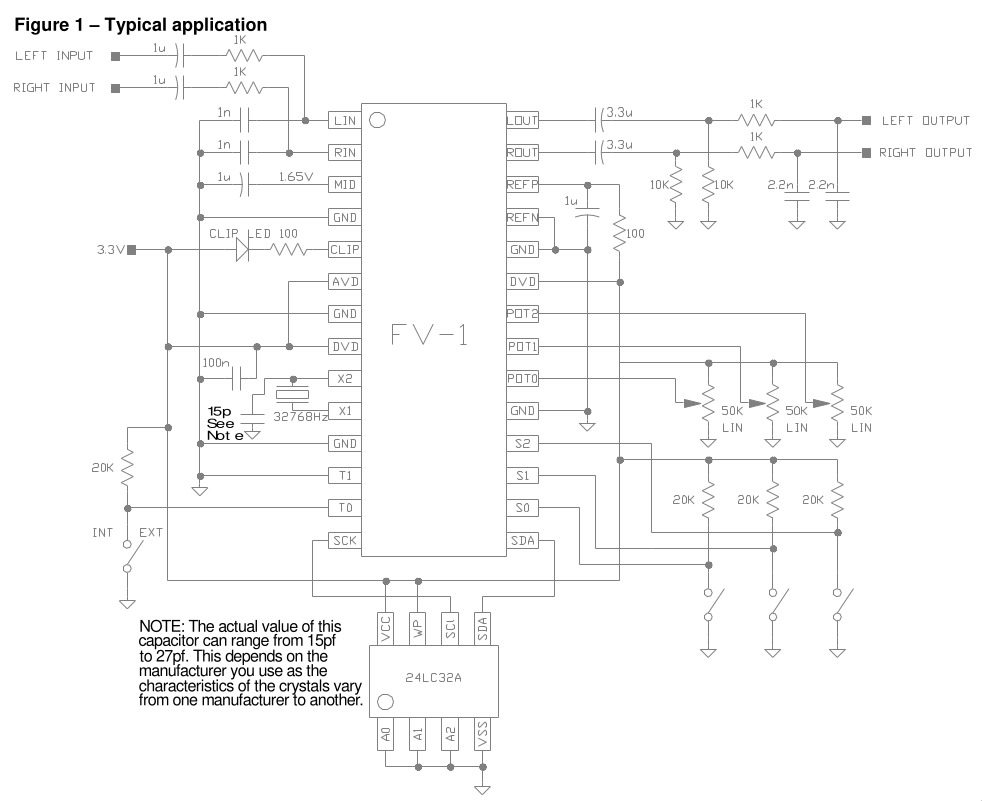

# Modding of JoMoX T-Resonator
Within this gist you will find instructions and ideas on how to mod your JoMoX T-Resonator.
The mod you will find here revolves around the FX section of the T-Resonator. What this enables
you to do is change the effects to new ones enabling your T-Resonator to produce different sounds
from the factory settings.

# Shoutouts
Big Thanks to <a href="https://github.com/ndf-zz/">ndf-zz</a> who wrote an assembler and disassembler
for the FV-1 chip in Python. Without your work this would not have been this easy. Check out his Python
assembler and disassembler:
- <a href="https://github.com/ndf-zz/asfv1">FV-1 Assembler</a>
- <a href="https://github.com/ndf-zz/disfv1">FV-1 Disassembler</a>

Big Thanks to <a href="https://github.com/mstratman">mstratman</a> for creating a curated list of FV-1
programs and Thanks to everyone contributing programs to the collection. This made testing new audio
effects on the T-Resonator much easier. Check out the collection of FV-1 programs here:
- <a href="https://mstratman.github.io/fv1-programs/">Huge list of FV-1 programs</a>

# Resources
Resources I came along during the trip down the rabbit hole.

## Resources for FV-1 Chip
IC is manufactured by Spinsemi:
- <a href="https://www.uk-electronic.de/PDF/FV-1.pdf">FV-1 Datasheet</a>

Getting information on how to program this chip is a little harder to obtain. However there
are some infos still around:
- <a href="https://xenvn.com/threads/spin-fv-1-audio-effects.125">FV-1 Audio Effects</a>
- <a href="https://xenvn.com/threads/spin-fv-1-instructions-and-syntax.122/">FV-1 Assembly Instructions and Syntax</a>
- <a href="https://xenvn.com/threads/basics-of-the-lfos-in-the-spin-fv-1.123/">FV-1 Basics of the lfos</a>

# Mod description
To understand the basis of this mod you have to have a look at the
<a href="https://www.uk-electronic.de/PDF/FV-1.pdf">FV-1 Datasheet</a>
and look at the basic FV-1 schematic.

 

What you should keep in mind from looking at it is that you can control this IC
with three potentiometers (which act as simple voltage dividers, so adding a
control voltage here is totally possible!) and that it uses an external EEPROM
to store effects programs. Reading the datasheet also reveals that you can switch
between 8 internal effects and 8 external effects stored on the EEPROM.
